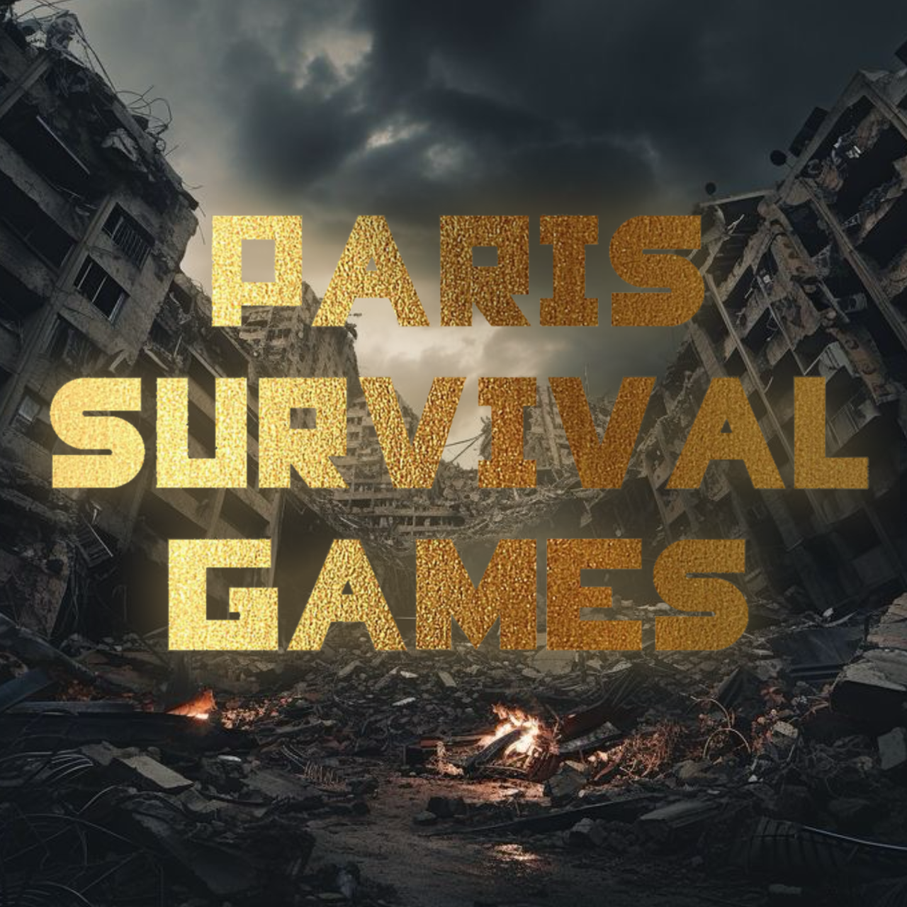

# Paris-Survival-Games

<!--  -->

<i>Description du jeu:</i>

Nous avons codé un jeu vidéo pour le trophée NSI inspiré de la saga <i>Hunger Games</i> permettant à l'utilisateur de jouer contre les représentants des autres arrondissements de Paris en participant à certains des sports présents aux Jeux Olympiques de Paris. Cependant, pour ajouter un peu de difficulté, si on rate certaines des épreuves sportives, nous pouvons être condamnés à mort.

<i>Contexte:</i>

Chaque année, des jeux sportifs sont organisés afin de déterminer quel arrondissement aura le plus de ressources. Tous les arrondissements étaient détruits par la famine, des représentants de chaque arrondissement (un homme et une femme) doivent concourir pour devenir le ou la grande gagnante de Paris qui bénéficieront de ressources presque illimitées pour le reste de leur vie. A l'inverse, les perdants sont exécutés. Ces jeux se déroulent dans le 5ème arrondissement d'un Paris dystopique.

<i>Nos inspirations:</i>

Au commencement, il a été décidé de créer un jeu sur le thème du sport; le problème étant: quel sport? Nous voulions nous baser sur une seule discipline sportive et en faire un jeu, mais, cela ne correspondait pas à nos ambitions, nous voulions faire plus. C'est ainsi que au fur et à mesure de nos recherches, nous avons remarqué que chaque membre du groupe est fan de la sage <i>Hunger Games</i>, mais comment inclure le sport dans cette saga? En réfléchissant, nous avons décidé de créer nos propres <i>Hunger Games</i> mais en y rajoutant un côté sportif, interractif et prenant place dans différents arrondissements de Paris: les <b><i>Paris Survival Games</i></b>
